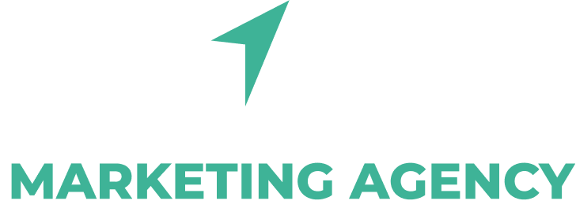

# OneClick Agency - Creative Digital Solutions 🚀

[](https://github.com/Abdelkarim17B/OneClick-Agency-Front-End/actions)
[](https://github.com/Abdelkarim17B/OneClick-Agency-Front-End/actions)
[](https://opensource.org/licenses/MIT)

A modern, interactive portfolio website for OneClick Digital Agency built with React, TypeScript, and beautiful parallax animations. This project showcases the agency's services including web development, digital marketing, motion graphics, and more.



## 📖 Story Behind This Project

This website was developed in 2023 as a passion project for a friend's digital agency. What started as a simple favor turned into an exciting exploration of modern web technologies and creative design patterns. The project demonstrates the power of React's component architecture combined with smooth parallax scrolling and responsive design principles.

**Fun fact**: The entire project was built during late-night coding sessions fueled by way too much coffee and a shared vision of creating something truly unique for the digital creative space.

## ✨ Features

- **🎭 Immersive Parallax Experience**: Multi-layered scrolling with @react-spring/parallax
- **📱 Zoom-Responsive Design**: Adaptive layouts that work across different zoom levels (67% to 150%)
- **🎨 Interactive Animations**: Smooth transitions and hover effects throughout
- **🏗️ Modern Architecture**: TypeScript + React with Vite for lightning-fast development
- **🎯 Section-Based Navigation**: Hero, About, Services, Testimonials, and Contact sections
- **🔧 Developer-Friendly**: ESLint, TypeScript, and modern tooling setup

## 🛠️ Tech Stack

- **Frontend**: React, TypeScript, Tailwind CSS
- **Build Tool**: Vite (because life's too short for slow builds)
- **Animations**: @react-spring/parallax, Lottie animations
- **Icons**: React Icons
- **Styling**: Tailwind CSS with custom responsive utilities
- **Deployment**: Docker + GitHub Actions for CI/CD

## 🚀 Quick Start

### Prerequisites

- Node.js 20+
- npm or yarn (whatever makes you happy)
- Docker (optional, for containerized development)

### Local Development

```bash
# Clone the repository
git clone https://github.com/Abdelkarim17B/OneClick-Agency-Front-End.git
cd OneClick-Agency-Front-End

# Install dependencies
npm install

# Start the development server
npm run dev

# Open your browser and navigate to http://localhost:5173
```

### Docker Development

```bash
# Build and run with Docker
docker build -t oneclick-agency .
docker run -p 3000:80 oneclick-agency

# Or use Docker Compose for a more integrated experience
docker-compose up -d
```

## 📂 Project Structure

```
src/
├── components/
│   ├── Content/
│   │   └── Home/
│   │       ├── Hero/          # Landing section with animations
│   │       ├── About/         # Agency introduction
│   │       ├── Services/      # Service showcase with horizontal scroll
│   │       ├── Testimonials/  # Client testimonials carousel
│   │       └── Footer/        # Contact and social media
│   ├── Responsiveness/        # Zoom context and responsive utilities
│   ├── Shared/               # Reusable components
│   └── Utils/                # Utility components
├── hooks/                    # Custom React hooks
└── assets/                   # Images, fonts, and static assets
```

## 🎨 Design Philosophy

This project embraces a **mobile-first, zoom-responsive** approach. Instead of traditional breakpoints, we use zoom-level detection to provide optimal viewing experiences across different device scales. It's like responsive design, but with a twist of innovation.

## 🔧 Development Scripts

```bash
npm run dev      # Start development server
npm run build    # Build for production
npm run preview  # Preview production build
npm run lint     # Run ESLint checks
```

## 🐳 Docker Support

The project includes a multi-stage Dockerfile optimized for production:

- **Stage 1**: Build the application with Node.js
- **Stage 2**: Serve with lightweight Nginx
- **Result**: ~15MB production image (because size matters)

## 🚀 CI/CD Pipeline

Automated workflows include:
- **Code Quality**: ESLint and TypeScript checks
- **Build Verification**: Ensure the project builds successfully
- **Docker Images**: Automated image building and pushing
- **Deployment**: Ready for your preferred hosting platform

## 📱 Current Status & Future Plans

### ✅ What's Working Great
- Smooth parallax scrolling experience
- Responsive design for desktop and tablet
- Interactive service showcase
- Beautiful animations and transitions

### 🛠️ Known Areas for Improvement
- **Mobile Responsiveness**: Currently optimized for larger screens, mobile version needs love
- **Portfolio Section**: Previous works showcase is on the roadmap
- **Performance**: Some animations could be optimized for slower devices
- **Accessibility**: ARIA labels and keyboard navigation improvements planned

This project is a testament to continuous learning and improvement. Every bug is a feature waiting to be discovered! 😄

## 🤝 Contributing

Found a bug? Have an idea? Want to make this project even more awesome?

1. Fork the repository
2. Create your feature branch (`git checkout -b feature/amazing-feature`)
3. Commit your changes (`git commit -m 'Add some amazing feature'`)
4. Push to the branch (`git push origin feature/amazing-feature`)
5. Open a Pull Request

## 📄 License

This project is licensed under the MIT License - see the [LICENSE](LICENSE) file for details.

## 🙏 Acknowledgments

- The OneClick Agency team for trusting me with their digital presence
- The React community for building amazing tools
- Coffee shops everywhere for providing the fuel that made this possible
- Stack Overflow and ChatGPT for being there when things broke at 2 AM xD

## 📞 Contact

**Project Maintainer**: Abdelkarim Bengherbia 
**Agency**: OneClick Digital Solutions  
**Year**: 2023  

---

*Built with ❤️ and probably too much caffeine. This project represents the beautiful chaos of turning creative ideas into digital reality.*
